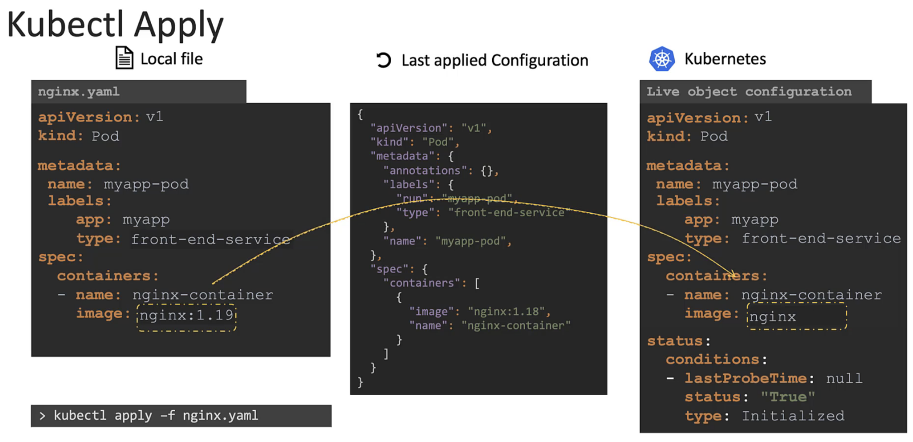
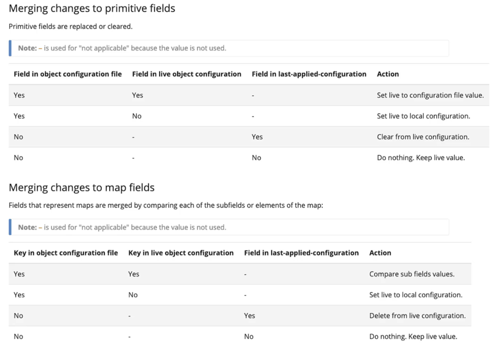
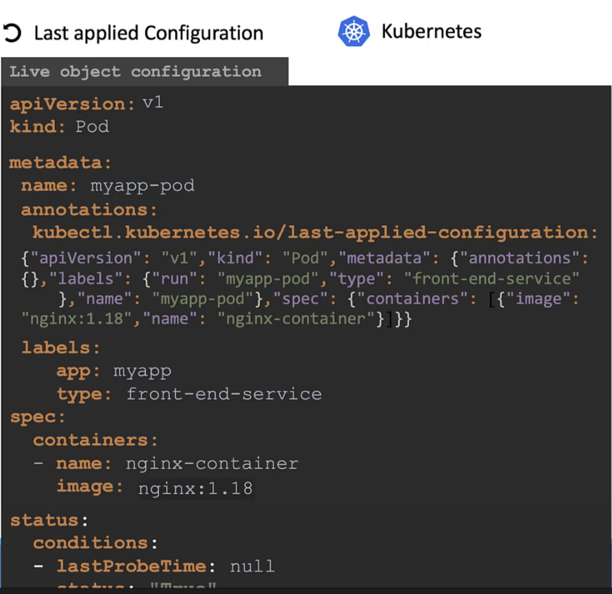

# Apply command

The apply command looks for the live definition object on kubernetes and also the present yml file 
and applies the changes that took place automatically

## To create/update objects we use 

```sh
> kubectl apply -f nginx.yml
```

## How the command works internally

   - If the object is already not created the apply command creates the object
    
    Adding `i` to the command makes the configuration file converted into a json format and stored as the last applied configuration

     

If a field is accidentally deleted we need the last configuration file to save the deployment
   Available in kube documentation:

    

Where last configuration is stored:

 