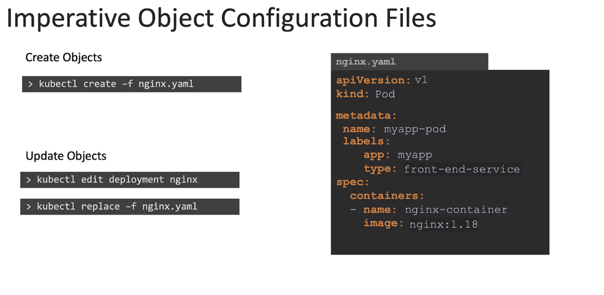
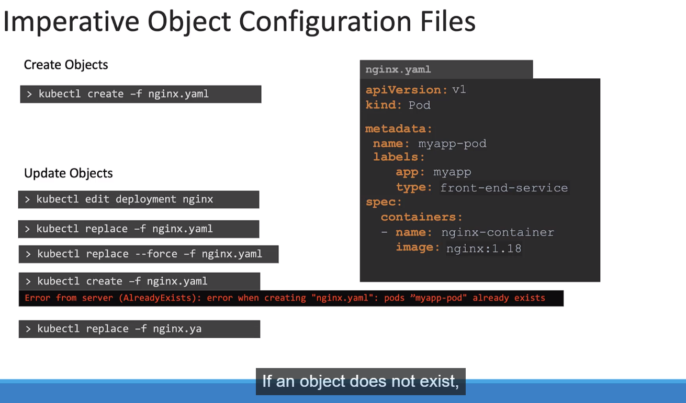

# Imperative vs Declarative

## Overview

## Imperative Approach

Advantages:

- Can be used to deploy applications fast without having to write a yaml file

Disadvantages:

- The commands are limited in functionality and require forming long and complex commands
- Run once and forgotten, only stored in the users session history
- Hence if there is a error in deployment its hard to backtrace to the exact command
- The infrastructure code is also not documented properly unlike being saved in a yaml file

### Not so better

- Changes made might be hard to keep track

### Better approach

!! Make sure the object always exists first before trying to make a update on it

## Declarative Approach

- apply command automatically takes care of the deployment

