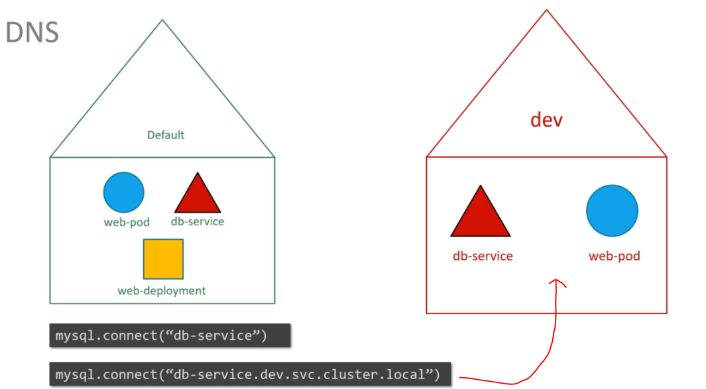
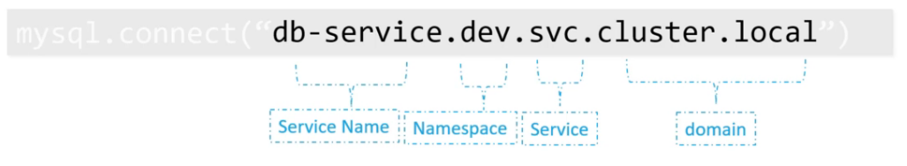

# Namespace

## Overview

Whatever we have been doing so far comes under a default namespace

Types of namespace:

- default
  - comes by default
- kube-system
  - Setup by kubernetes for internal purpose
  - Networking solution, DNS Service etc
  - To prevent you from accidentally deleting or modifying the services
- kube-public
  - Created automatically
  - Resources that are made available to all users

!! If we are playing around with small clusters then don't worry about namespaces

## Extracting services in another namespace



## Namespaces are used by process to access other process

`
mysql.connect("db-service.dev.svc.cluster.local")
`



## To list pods in another namespace enter this command

```sh
> kubectl get pods --namespace=kube-system
```

`pod-definition.yml` file

```yml

apiVersion: v1
kind: Pod

metadata:
    name: myapp-pod
    namespace: dev
    labels:
        app: myapp
        type: front-end
spec:
    containers:
    - name: nginx-controller
      image: nginx
```

To create namespace in a specific namespace

```sh
> kubectl create -f pod-definition.yml --namespace=dev
```

## Namespace definition yml file

namespace-dev.yml

```yml
apiVersion: v1
kind: Namespace
metadata:
    name: dev
```

```sh
> kubectl create -f namespace-dev.yml 
```

### Or

```sh
> kubectl create namespace dev
```

### Getting resources under a given namespace

```sh
> kubectl get pods --namespace=dev
```

```sh
> kubectl get pods  # gives default namespace
```

## To switch to other namespace context

```sh
> kubectl config set-context $(kubectl config current-context) --namespace=dev
```

## To get pods in all namespace

```sh
> kubectl get pods --all-namespaces
```

