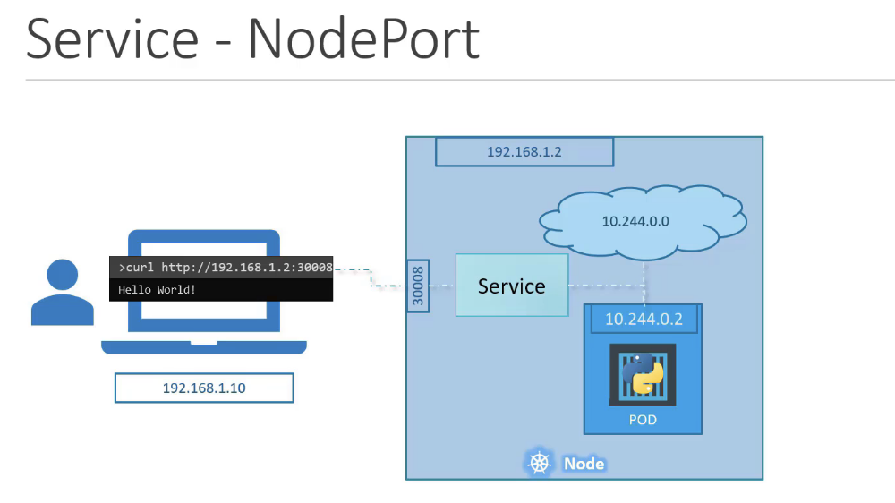
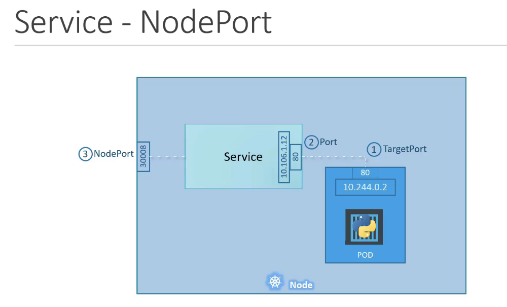
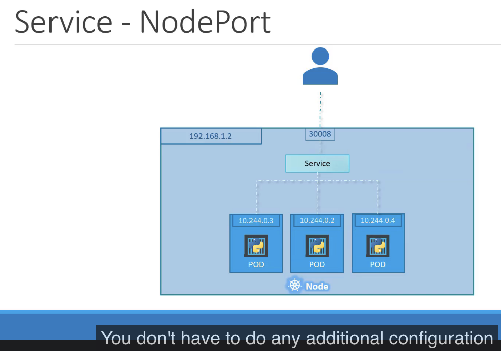
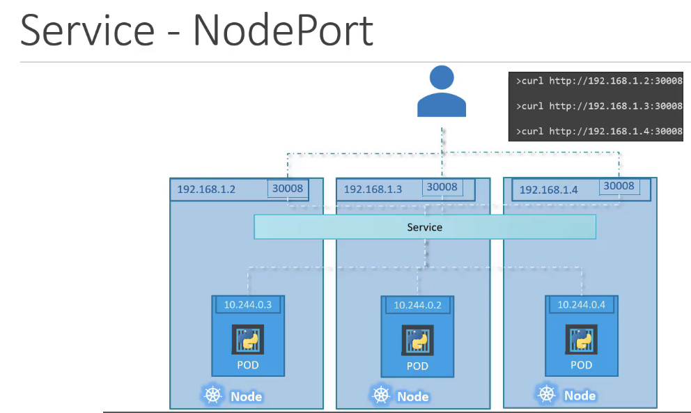

## What are Services?
- Its a object just like Pods, ReplicaSet, Deployment, etc
- Listens to a port on the node and forward request on that port to a port on the Pod running the web application (NodePort)
- Kubernetes Services enable communication between various components within and outside of the application
- Helps us connect applications together or with other applications or users

Ex: Group of frontend pods being able to communicate to the backend group of pods
- Services enable loose coupling between microservices in out application

### Problem: 
To access the pod api we ssh into the master node and then perform a curl command:
```sh
> curl http://10.244.0.2
```

We have to setup a middleware for us to directly access the master Node API and get response from Pod service 
```sh
> curl http://192.168.1.2
```

## Service Types:

  1. NodePort

    Service makes an internal port accessible on a port on the node
    Ex:


    
    !! Node port can only be in the range between 30000 - 32767
    
    !! if a nodeport is not specified one is automatically assigned within the above range
 ### sample file: nodeService-definition.yml
```yml
apiVersion: v1
kind: Service
metadata:
    name: myapp-service
spec:
    type: NodePort
    ports:
    - targetPort: 80
        port: 80
        nodePort: 30008
    selector:
        app: myapp
        type: front-end
```
```sh
> kubectl create -f nodeService-definition.yml
> kubectl get services
> curl http://192.168.1.2.30008
```
    !! For multiple pods under the same Node, we don't have to do any additional configuration as Services will automatically map all the three pod endpoints to the service port


- Algorithm: Random
- SessionAffinity: yes


 
 
 
 
  2. ClusterIP

    - Service creates a virtual IP inside the cluster to enable communication between different services such as a set of frontend servers to a set of backend servers
    - IPs are not static

  3. LoadBalancer

    - Provisions a loadBalancer for our application in supported cloud providers
