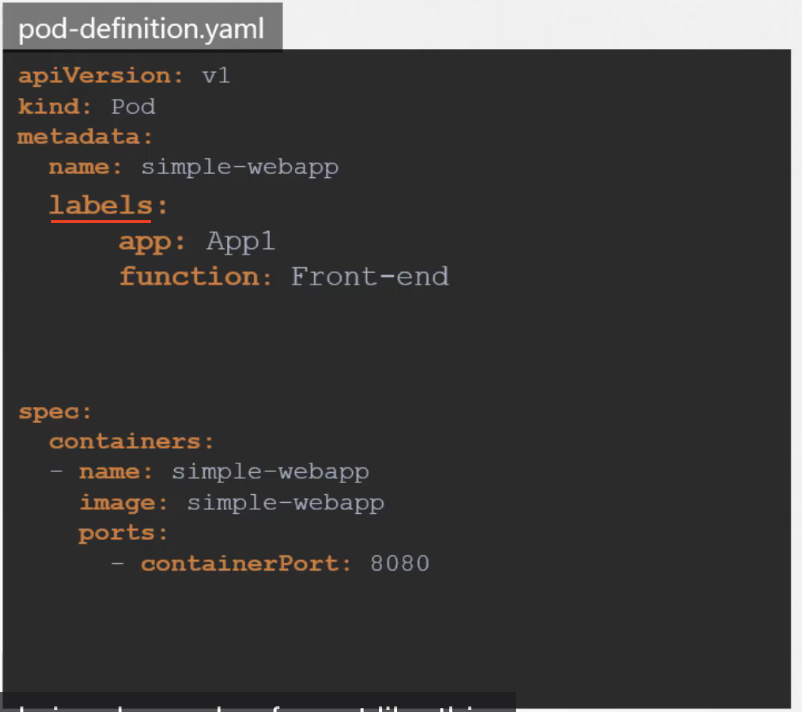
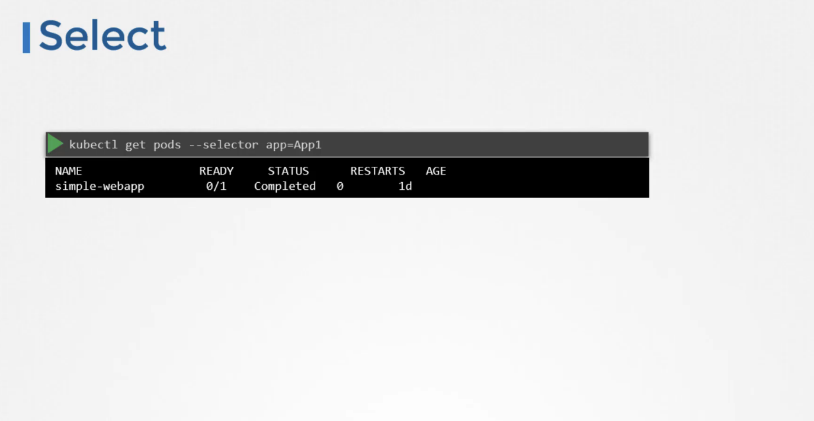

# Labels and Selectors

## Why use them

Overtime in K8s development we will have 100s or 1000s of objects 
We can group and select objects using `labels and selectors`

* For each object we can attach labels
* While selecting objects, we can specify condition to filter specific objects

## Sample Label in pod-definition.yml file

- We can add as `many labels` as we want to a given pod

### Selecting pods based on label

