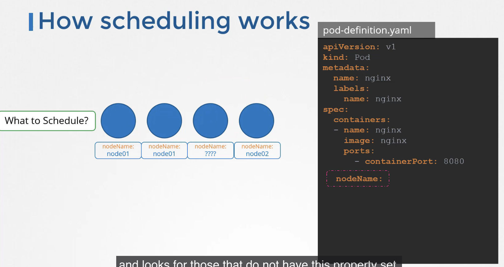
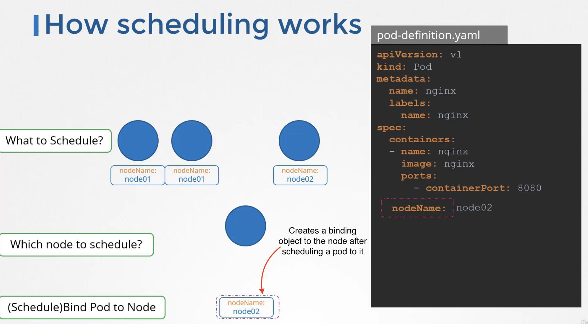
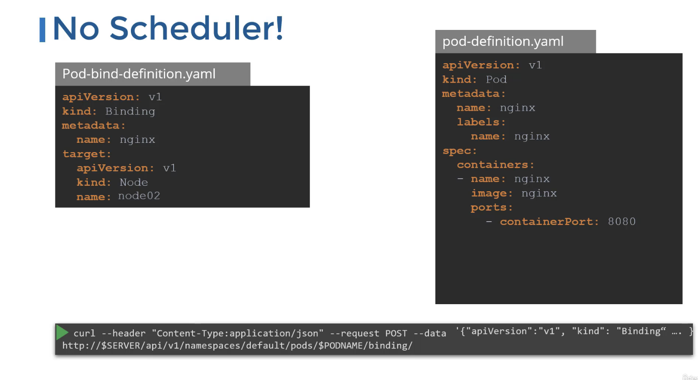

# Manual Scheduling

## How scheduling works
- nodeName is normally not specified by us in the yml file, but it is self generated by kubernetes






!! Kubernetes would not allow us to add/modify the nodeName information in the yml after the creation of a pod

### Instead we have to do this

We have to create a binding object through pod-bind yml 
and then send a post request to the pod's binding API



^ This is what the actual scheduler does

## Tip

Use

```sh
> kubectl replace --force -f nginx.yaml
```